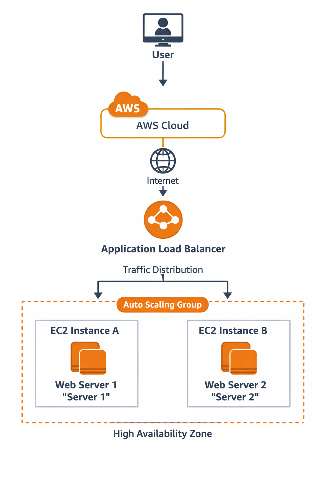
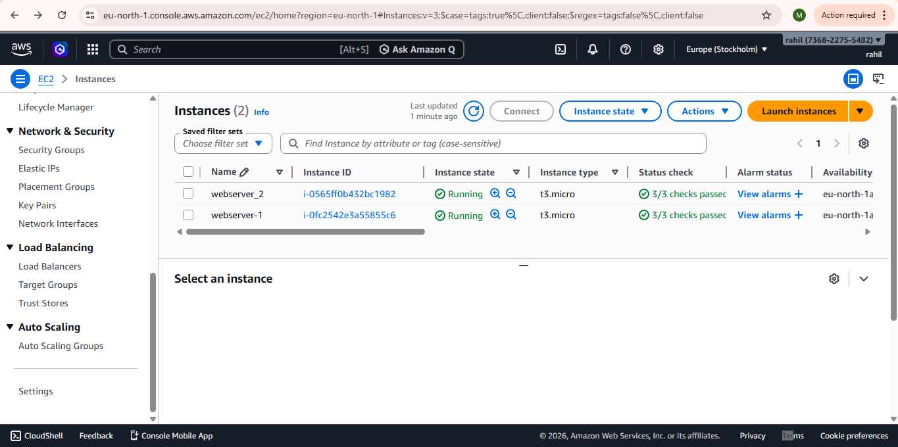
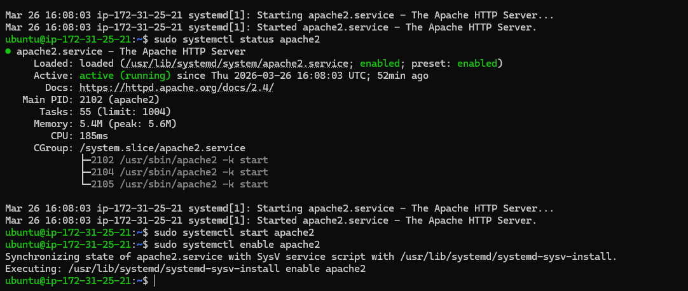
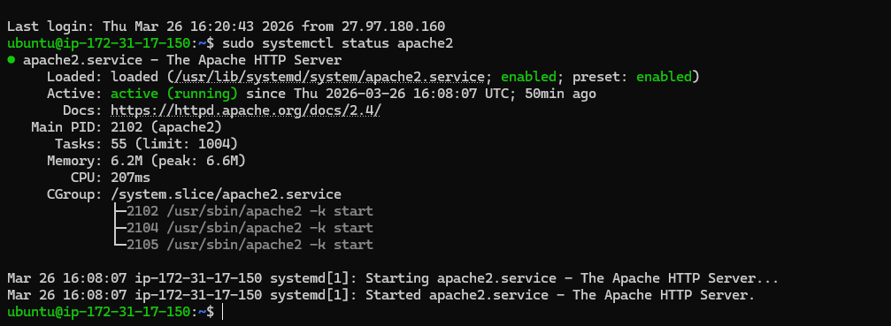
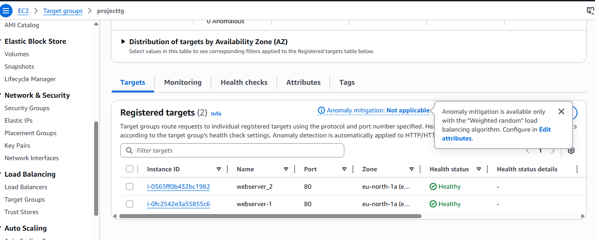
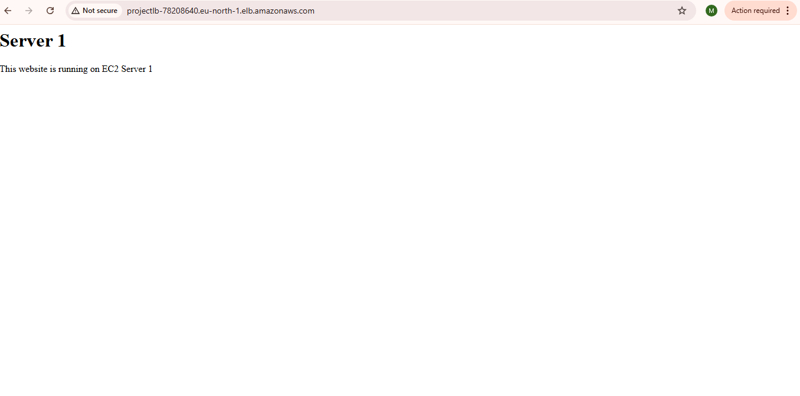
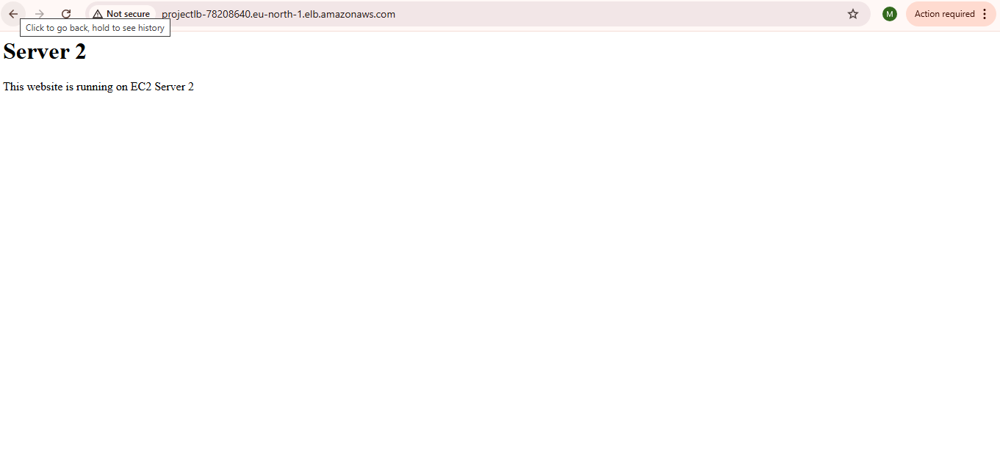

# AWS High Availability Web Hosting using EC2 and Application Load Balancer

## Project Overview

This project demonstrates how to implement high availability web hosting using AWS services. Two EC2 instances run Apache web servers, and an Application Load Balancer distributes traffic between them.

## AWS Services Used

* Amazon EC2
* Application Load Balancer
* Target Groups
* Security Groups
* AWS IAM

## Technologies Used

* Linux (Ubuntu)
* Apache Web Server
* SSH

## Architecture

The architecture consists of two EC2 instances hosting web servers. An Application Load Balancer distributes incoming traffic between the instances, ensuring high availability.

## Implementation Steps

### 1 Launch EC2 Instances

* Created two Ubuntu EC2 instances
* Installed Apache web server on both instances

### 2 Configure Web Servers

Each server hosts a different web page to verify load balancing.

### 3 Create Application Load Balancer

* Created a Load Balancer
* Configured target group
* Registered EC2 instances

### 4 Configure Health Checks

Health checks monitor the status of each EC2 instance.

### 5 Test Load Balancing

Accessed the application using the Load Balancer DNS name and confirmed traffic distribution.

## Learning Outcomes

* Understanding high availability architecture
* Configuring AWS Application Load Balancer
* Managing multiple EC2 instances
* Implementing load balancing and health checks

## Author

Mohammad Rahil
Aspiring Cloud Support Engineer
## Project Architecture

## Project Screenshots

### EC2 Instances Running

### Apache Web Server Running on Server 1

### Apache Web Server Running on Server 2

### Application Load Balancer

### Target Group Configuration

### Website Response from Server 1

### Website Response from Server 2

